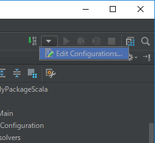
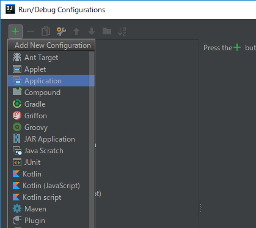
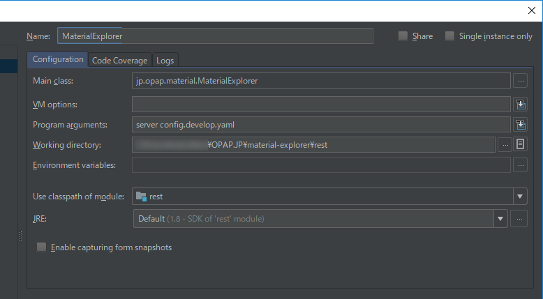

## 開発環境

#### Windows

[Docker for Windows](https://docs.docker.com/docker-for-windows/install/)がインストールされていることが前提です。

##### Scala 環境

1. 統合開発環境 [IntelliJ IDEA Community Edition](https://www.jetbrains.com/idea/download/#section=windows) をインストールします。
1. IntelliJ IDEA を起動し、[Wellcome to IntelliJ IDEA] ウィンドウで、 "Configure" -> "Plugins" -> "Browse Repositories" を開きます。
  "Scala" を検索し、インストールします。IntelliJ IDEA を再起動します。
1. "Import Project" で、 (project)/rest/build.sbt を開きます。
1. 適当な SBT バージョンを指定してダウンロードします。
1. Scala プロジェクトが開かれます。
1. "Edit Configuration" を開き、新規の "Application" を作成します。  
   
  
1. "Name" に適当な名称を入力します。 
  "Main class" で `jp.opap.material.MaterialExplorer` を選択します。 
  "Program arguments"に `server config.develop.yaml` と入力します。 
  "Use classpath module" で "rest" を選択します。 
  

##### npm 環境

1. [Node.js](https://nodejs.org/ja/download/) をインストールします。

### Docker Compose によるアプリケーションの実行

#### Windows

[Docker for Windows](https://docs.docker.com/docker-for-windows/install/)がインストールされていることが前提です。

##### テスト用コンテナ

1. Windows PowerShell を開き、カレントディレクトリがこのプロジェクトのルートフォルダ（`docker-compose.yaml` があるフォルダ）になるようにします。
1. `docker-compose -f .\docker-compose.test.yaml up --build` で Docker イメージのビルドとコンテナの起動を行ないます。初回のビルドには20分前後の時間がかかります。
1. [http://localhost](http://localhost) でアプリケーションの動作を確認できます。
1. Ctrl + C で Docker コンテナをシャットダウンします。

##### 開発用コンテナ

1. Windows PowerShell を開き、カレントディレクトリがこのプロジェクトのルートフォルダ（`docker-compose.yaml` があるフォルダ）になるようにします。
1. `docker-compose up --build` で Docker イメージのビルドとコンテナの起動を行ないます。
1. IntelliJ IDEA で、事前に設定した構成でプロジェクトを起動します。[http://localhost:8080](http://localhost:8080) でREST サーバーが実行されます。
    - プログラムを終了し、変更してから再び起動すると、変更が反映されたプログラムが起動します。
1. 別の Windows PowerShell を開き、カレントディレクトリが `web` になるようにします。
    - 初回か、`package.json` が更新されたときは、`npm install` を実行します。
1. `npm run serve` で、開発用ウェブサーバーが起動します。[http://localhost:8000](http://localhost:8000) が自動的に開かれます。
    - Gulp によってファイルの変更が監視されているため、ソースを変更すると自動的にコンパイルが行なわれ、画面も自動的に更新されます。
1. REST サーバーの開発ではウェブサーバーを実行しておき、ウェブサーバーの開発では REST サーバーを実行しておくようにしましょう。
